# Plan et al - Ultimate Co-planner Backend

A comprehensive event planning platform backend built with FastAPI, designed to make event planning collaborative, stress-free, and enjoyable.

##  Backend Architecture System Design

```mermaid
graph TB
    %% Client Layer
    subgraph "Client Layer"
        WEB[Web App]
        MOBILE[Mobile App]
        API_CLIENT[API Clients]
    end

    %% API Gateway & Load Balancer
    subgraph "API Gateway Layer"
        LB[Load Balancer]
        GATEWAY[API Gateway<br/>Rate Limiting<br/>Authentication<br/>CORS]
    end

    %% Application Layer
    subgraph "FastAPI Application Layer"
        subgraph "API Routes (v1)"
            AUTH_API[Auth API<br/>JWT, MFA, Biometric]
            USER_API[User API<br/>Profile Management]
            EVENT_API[Event API<br/>CRUD Operations]
            AI_API[AI API<br/>Smart Suggestions]
            VENDOR_API[Vendor API<br/>Service Providers]
            CALENDAR_API[Calendar API<br/>Integration]
            WEBSOCKET[WebSocket<br/>Real-time Updates]
        end
        
        subgraph "Middleware"
            RATE_LIMIT[Rate Limiter]
            CIRCUIT_BREAKER[Circuit Breaker]
            SECURITY[Security Headers]
            CORS[CORS Handler]
        end
    end

    %% Service Layer
    subgraph "Business Logic Layer"
        subgraph "Core Services"
            AUTH_SVC[Auth Service<br/>JWT, Password Hash]
            USER_SVC[User Service<br/>Profile Management]
            EVENT_SVC[Event Service<br/>Event Logic]
            AI_SVC[AI Service<br/>OpenAI Integration]
            NOTIFICATION_SVC[Notification Service<br/>Email, SMS, Push]
        end
        
        subgraph "Integration Services"
            CALENDAR_SVC[Calendar Service<br/>Google/Apple Cal]
            MAPS_SVC[Maps Service<br/>Google Maps API]
            PAYMENT_SVC[Payment Service<br/>Stripe Integration]
            STORAGE_SVC[Storage Service<br/>GCP Cloud Storage]
            EMAIL_SVC[Email Service<br/>SMTP/SendGrid]
        end
    end

    %% Repository Layer
    subgraph "Data Access Layer"
        USER_REPO[User Repository]
        EVENT_REPO[Event Repository]
        VENDOR_REPO[Vendor Repository]
        CALENDAR_REPO[Calendar Repository]
        NOTIFICATION_REPO[Notification Repository]
    end

    %% Database Layer
    subgraph "Database Layer"
        POSTGRES[(PostgreSQL<br/>Primary Database)]
        REDIS[(Redis<br/>Cache & Sessions)]
        SQLITE[(SQLite<br/>Development)]
    end

    %% External Services
    subgraph "External Services"
        OPENAI[OpenAI API<br/>AI Suggestions]
        GOOGLE_CAL[Google Calendar API]
        APPLE_CAL[Apple Calendar API]
        GOOGLE_MAPS[Google Maps API]
        STRIPE[Stripe API<br/>Payments]
        GCP_STORAGE[GCP Cloud Storage]
        SENDGRID[SendGrid<br/>Email Service]
        TWILIO[Twilio<br/>SMS Service]
        FCM[Firebase<br/>Push Notifications]
    end

    %% Background Tasks
    subgraph "Background Processing"
        CELERY[Celery Workers<br/>Async Tasks]
        SCHEDULER[Celery Beat<br/>Scheduled Tasks]
        TASK_QUEUE[Redis Queue<br/>Task Management]
    end

    %% Monitoring & Security
    subgraph "Monitoring & Security"
        LOGGING[Structured Logging]
        METRICS[Performance Metrics]
        HEALTH[Health Checks]
        SECURITY_SCAN[Security Scanning]
    end

    %% Connections
    WEB --> LB
    MOBILE --> LB
    API_CLIENT --> LB
    
    LB --> GATEWAY
    GATEWAY --> AUTH_API
    GATEWAY --> USER_API
    GATEWAY --> EVENT_API
    GATEWAY --> AI_API
    GATEWAY --> VENDOR_API
    GATEWAY --> CALENDAR_API
    GATEWAY --> WEBSOCKET
    
    AUTH_API --> AUTH_SVC
    USER_API --> USER_SVC
    EVENT_API --> EVENT_SVC
    AI_API --> AI_SVC
    VENDOR_API --> USER_SVC
    CALENDAR_API --> CALENDAR_SVC
    
    AUTH_SVC --> USER_REPO
    USER_SVC --> USER_REPO
    EVENT_SVC --> EVENT_REPO
    CALENDAR_SVC --> CALENDAR_REPO
    NOTIFICATION_SVC --> NOTIFICATION_REPO
    
    USER_REPO --> POSTGRES
    EVENT_REPO --> POSTGRES
    VENDOR_REPO --> POSTGRES
    CALENDAR_REPO --> POSTGRES
    NOTIFICATION_REPO --> POSTGRES
    
    AUTH_SVC --> REDIS
    USER_SVC --> REDIS
    
    AI_SVC --> OPENAI
    CALENDAR_SVC --> GOOGLE_CAL
    CALENDAR_SVC --> APPLE_CAL
    MAPS_SVC --> GOOGLE_MAPS
    PAYMENT_SVC --> STRIPE
    STORAGE_SVC --> GCP_STORAGE
    EMAIL_SVC --> SENDGRID
    NOTIFICATION_SVC --> TWILIO
    NOTIFICATION_SVC --> FCM
    
    CELERY --> TASK_QUEUE
    SCHEDULER --> TASK_QUEUE
    TASK_QUEUE --> REDIS
    
    %% Styling
    classDef clientLayer fill:#e1f5fe
    classDef apiLayer fill:#f3e5f5
    classDef serviceLayer fill:#e8f5e8
    classDef dataLayer fill:#fff3e0
    classDef externalLayer fill:#fce4ec
    classDef backgroundLayer fill:#f1f8e9
    
    class WEB,MOBILE,API_CLIENT clientLayer
    class LB,GATEWAY,AUTH_API,USER_API,EVENT_API,AI_API,VENDOR_API,CALENDAR_API,WEBSOCKET apiLayer
    class AUTH_SVC,USER_SVC,EVENT_SVC,AI_SVC,NOTIFICATION_SVC,CALENDAR_SVC,MAPS_SVC,PAYMENT_SVC,STORAGE_SVC,EMAIL_SVC serviceLayer
    class USER_REPO,EVENT_REPO,VENDOR_REPO,CALENDAR_REPO,NOTIFICATION_REPO,POSTGRES,REDIS,SQLITE dataLayer
    class OPENAI,GOOGLE_CAL,APPLE_CAL,GOOGLE_MAPS,STRIPE,GCP_STORAGE,SENDGRID,TWILIO,FCM externalLayer
    class CELERY,SCHEDULER,TASK_QUEUE backgroundLayer
```

<div align="center">



</div>

### Architecture Overview

The **Plan et al** backend follows a **layered microservices architecture** with the following key components:

####  **Request Flow**
1. **Client Layer** → API requests from web/mobile apps
2. **API Gateway** → Rate limiting, authentication, routing
3. **FastAPI Application** → Route handling and validation
4. **Service Layer** → Business logic processing
5. **Repository Layer** → Data access abstraction
6. **Database Layer** → Data persistence and caching

####  **Security Features**
- **JWT Authentication** with refresh token rotation
- **Multi-Factor Authentication** (MFA) support
- **Biometric Authentication** for mobile devices
- **Rate Limiting** per endpoint and user
- **Circuit Breaker** pattern for external services
- **Input Validation** with Pydantic schemas
- **SQL Injection Prevention** with SQLAlchemy ORM

#### ⚡ **Performance Features**
- **Redis Caching** for sessions and frequently accessed data
- **Connection Pooling** for database connections
- **Async/Await** patterns throughout the application
- **Background Task Processing** with Celery
- **Query Optimization** with performance monitoring
- **Load Balancing** ready architecture

#### 🔌 **Integration Capabilities**
- **Calendar Sync** (Google Calendar, Apple Calendar)
- **AI-Powered Suggestions** via OpenAI API
- **Payment Processing** through Stripe
- **Cloud Storage** with GCP integration
- **Real-time Communication** via WebSockets
- **Multi-channel Notifications** (Email, SMS, Push)

##  Features

### Core Features
- **Event Management**: Create, organize, and manage events of all types
- **Guest Management**: Invite guests, track RSVPs, and manage attendee lists
- **Task Management**: Create and assign tasks with deadlines and priorities
- **Budget Tracking**: Track expenses and split costs among participants
- **Real-time Collaboration**: Comments, polls, and collaborative planning
- **Media Sharing**: Upload and share photos, videos, and documents

### Advanced Features
- **AI-Powered Suggestions**: Smart recommendations for venues, vendors, and planning
- **Social Features**: Friend connections and event discovery
- **Notification System**: Email and push notifications for important updates
- **Calendar Integration**: Sync with Google/Apple Calendar
- **Mobile-Friendly API**: RESTful API designed for mobile and web clients

## 🛠 Tech Stack

- **Framework**: FastAPI 0.104+
- **Database**: SQLAlchemy with SQLite/PostgreSQL
- **Authentication**: JWT with refresh tokens
- **Validation**: Pydantic v2
- **Background Tasks**: Celery with Redis
- **File Storage**: Local/GCP Cloud Storage support
- **Documentation**: Auto-generated OpenAPI/Swagger

##  Prerequisites

- Python 3.10+
- pip or poetry
- Redis (for background tasks)
- PostgreSQL (optional, SQLite by default)

##  Quick Start

### 1. Clone the Repository
```bash
git clone <repository-url>
cd UltimateCo-planner-Backend
```

### 2. Set Up Virtual Environment
```bash
python -m venv venv
source venv/bin/activate  # On Windows: venv\Scripts\activate
```

### 3. Install Dependencies
```bash
pip install -r requirements.txt
```

### 4. Environment Configuration
```bash
cp .env.example .env
# Edit .env with your configuration
```

### 5. Initialize Database
```bash
# Initialize Alembic
alembic init app/db/migrations

# Create first migration
alembic revision --autogenerate -m "Initial migration"

# Apply migrations
alembic upgrade head
```

### 6. Run the Application
```bash
uvicorn app.main:app --reload
```

The API will be available at `http://localhost:8000`

## 🐳 Docker Setup

### Development with Docker Compose
```bash
# Start all services
docker-compose up -d

# View logs
docker-compose logs -f api

# Stop services
docker-compose down
```

### Production Deployment
```bash
# Build and run with production profile
docker-compose --profile production up -d
```

##  API Documentation

Once the server is running, visit:
- **Swagger UI**: `http://localhost:8000/docs`
- **ReDoc**: `http://localhost:8000/redoc`
- **OpenAPI JSON**: `http://localhost:8000/openapi.json`

## 🔧 Configuration

### Environment Variables

Key configuration options in `.env`:

```env
# Database
DATABASE_URL=sqlite:///./planetal.db

# Security
SECRET_KEY=your-secret-key
ACCESS_TOKEN_EXPIRE_MINUTES=30

# Email
SMTP_HOST=smtp.gmail.com
SMTP_USER=your-email@gmail.com
SMTP_PASSWORD=your-app-password

# External APIs
OPENAI_API_KEY=your-openai-key
GOOGLE_MAPS_API_KEY=your-maps-key
```

## 🏗 Project Structure

```
app/
├── api/                    # API routes
│   ├── v1/
│   │   ├── routers/
│   │   │   ├── auth.py     # Authentication endpoints
│   │   │   ├── users.py    # User management
│   │   │   └── events.py   # Event management
│   │   └── api_router.py   # Main API router
│   └── health.py           # Health check endpoints
├── core/                   # Core functionality
│   ├── deps.py            # Dependencies
│   ├── security.py        # Security utilities
│   └── errors.py          # Error handling
├── db/                     # Database
│   ├── base.py            # Database base
│   ├── session.py         # Database sessions
│   └── migrations/        # Alembic migrations
├── models/                 # SQLAlchemy models
│   ├── user_models.py     # User-related models
│   ├── event_models.py    # Event-related models
│   ├── media_models.py    # Media models
│   └── shared_models.py   # Shared models and enums
├── schemas/                # Pydantic schemas
│   ├── user.py            # User schemas
│   ├── event.py           # Event schemas
│   └── pagination.py      # Pagination schemas
├── services/               # Business logic
│   ├── auth_service.py    # Authentication service
│   ├── user_service.py    # User service
│   └── event_service.py   # Event service
├── repositories/           # Data access layer
│   ├── user_repo.py       # User repository
│   └── event_repo.py      # Event repository
├── tasks/                  # Background tasks
│   ├── celery_app.py      # Celery configuration
│   └── reminder_tasks.py  # Reminder tasks
├── utils/                  # Utilities
├── tests/                  # Test files
├── config.py              # Configuration
└── main.py                # FastAPI application
```

##  Authentication

The API uses JWT tokens with refresh token rotation:

1. **Register**: `POST /api/v1/auth/register`
2. **Login**: `POST /api/v1/auth/login`
3. **Refresh**: `POST /api/v1/auth/refresh`
4. **Logout**: `POST /api/v1/auth/logout`


##  Database Schema

### Key Models

- **User**: User accounts and profiles
- **Event**: Event information and settings
- **EventInvitation**: Guest invitations and RSVPs
- **Task**: Event tasks and assignments
- **Expense**: Budget tracking and expense splitting
- **Media**: File uploads and media sharing
- **Comment**: Event discussions
- **Poll**: Decision-making polls

##  Testing

```bash
# Run all tests
pytest

# Run with coverage
pytest --cov=app

# Run specific test file
pytest tests/test_auth.py

# Development
ENVIRONMENT=development
DEBUG=true

# Production
ENVIRONMENT=production
DEBUG=false
```


### Database Migrations

```bash
# Create migration
alembic revision --autogenerate -m "Description"

# Apply migrations
alembic upgrade head

# Rollback migration
alembic downgrade -1
```

### Background Tasks

```bash
# Start Celery worker
celery -A app.tasks.celery_app worker --loglevel=info

# Start Celery beat (scheduler)
celery -A app.tasks.celery_app beat --loglevel=info

# Monitor tasks
celery -A app.tasks.celery_app flower
```

## Monitoring

### Health Checks

- **Basic**: `GET /health/`
- **Detailed**: `GET /health/detailed`
- **Readiness**: `GET /health/ready`
- **Liveness**: `GET /health/live`

### Logging

Logs are structured and include:
- Request/response logging
- Error tracking
- Performance metrics
- Security events

## Contributing

1. Fork the repository
2. Create a feature branch
3. Make your changes
4. Add tests
5. Run quality checks
6. Submit a pull request

##  License

This project is licensed under the MIT License - see the LICENSE file for details.

##  Support

For support and questions:
- Create an issue on GitHub
- Check the documentation
- Review the API docs at `/docs`


**Plan et al** - Making event planning collaborative and stress-free!