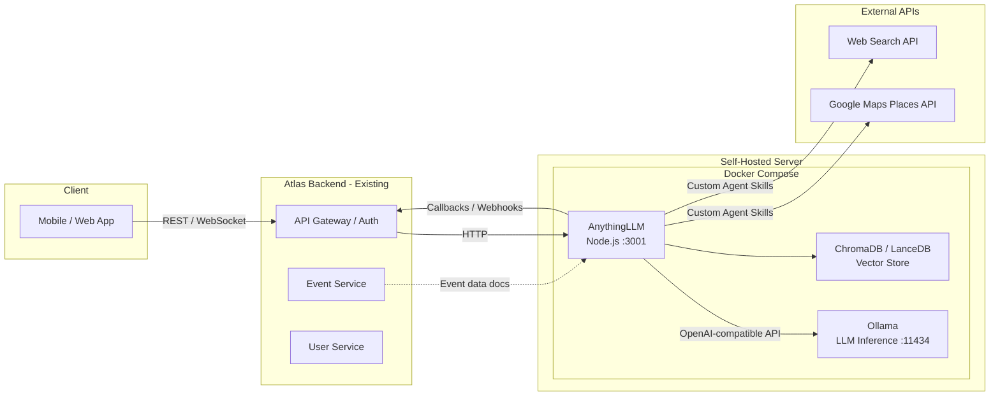
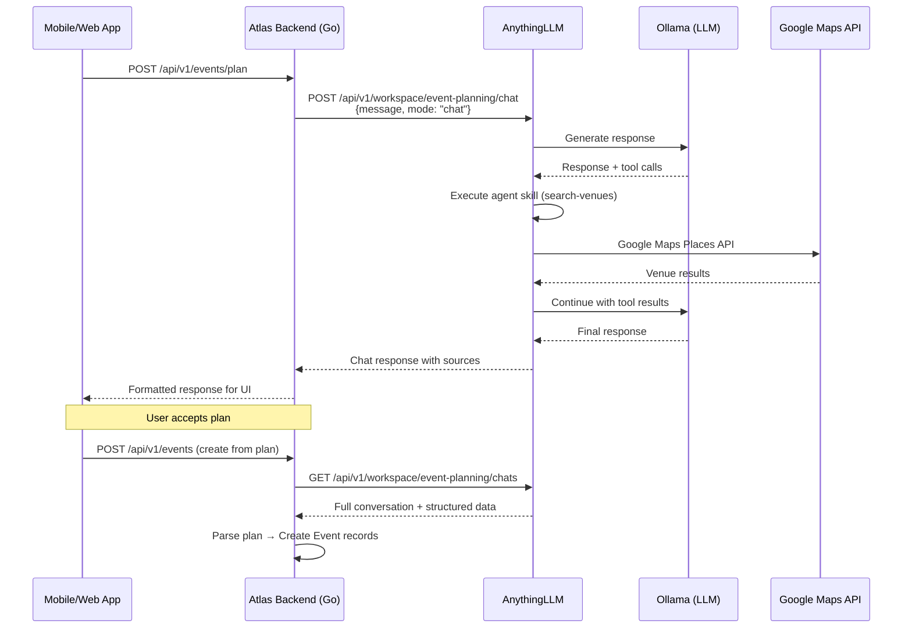
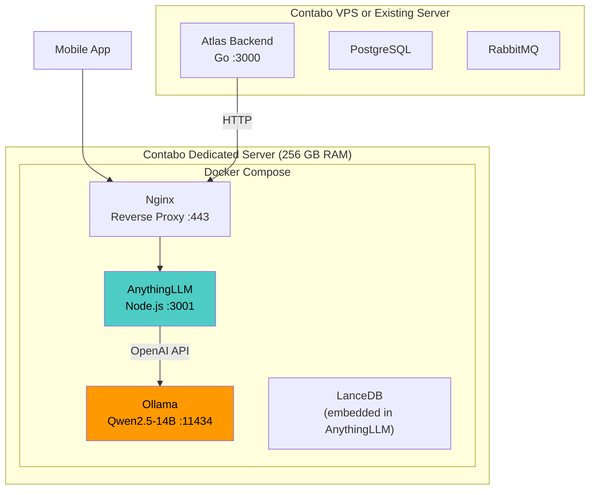
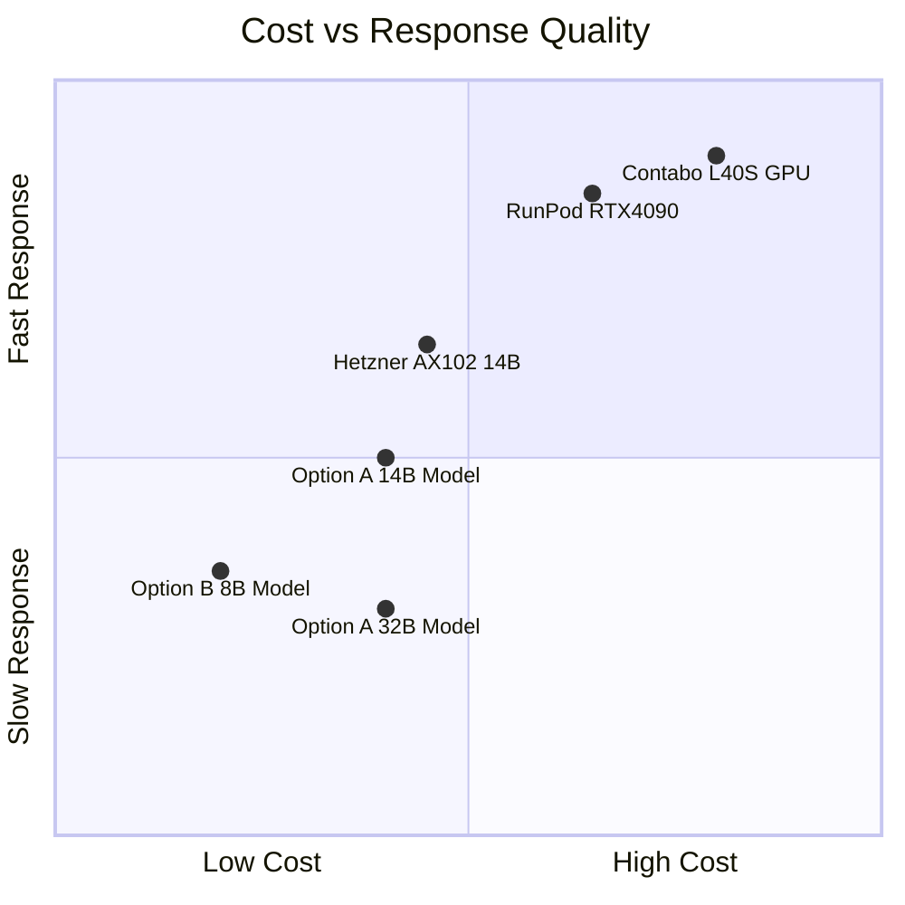

# AI Event Planner Service — AnythingLLM Implementation Plan

A reimagined approach that uses **AnythingLLM** as the central orchestration layer, replacing the custom FastAPI + LangChain stack from the original spec. AnythingLLM handles conversation management, RAG, agent tool-calling, and LLM routing out of the box — dramatically reducing custom code, time-to-production, and operational complexity.

---

## 1. Why AnythingLLM?

| Concern | Custom Stack (Original Plan) | AnythingLLM Approach |
|---|---|---|
| **Conversation management** | Build from scratch (LangGraph state machine + Redis) | Built-in workspaces with persistent chat history |
| **LLM integration** | Write OpenAI-compatible client, manage prompts | Plug-and-play — supports 30+ LLM providers including Ollama & vLLM |
| **Tool / function calling** | Implement tool executor, schema definitions | Built-in Agent builder + custom agent skills (JS plugins) |
| **RAG / document ingestion** | Not in original scope | Built-in — upload venue catalogs, pricing guides, menus as workspace docs |
| **API for Atlas integration** | Build full REST API layer | Full REST API included (`/api/v1/workspace/...`, `/api/v1/chat/...`) |
| **Auth & multi-user** | Build middleware | Built-in multi-user with roles (Admin, Manager, Default) |
| **Web UI for testing** | None (API-only) | Included — useful for internal testing and admin |
| **Time to MVP** | 4-6 weeks | 1-2 weeks |
| **Maintenance burden** | High (custom Python codebase) | Low (community-maintained, Docker updates) |

> [!TIP]
> AnythingLLM lets you focus engineering effort on the **event-planning domain logic** (custom agent skills, Atlas integration) rather than reinventing chat infrastructure.

---

## 2. High-Level Architecture



**Key changes from original plan:**
- **AnythingLLM** replaces FastAPI + LangChain + Redis + custom conversation manager
- **Ollama** replaces vLLM (simpler for CPU-first deployment; vLLM remains an option for GPU)
- **LanceDB** (bundled with AnythingLLM) replaces a separate vector DB for RAG
- Custom **agent skills** (JS plugins) handle external API calls (Google Maps, web search)

---

## 3. Infrastructure Options

### 3.1 Contabo Server Comparison

The two Contabo servers represent fundamentally different tiers — a **high-memory dedicated server** ideal for running larger quantized models on CPU, and a **modern VPS** better suited for smaller models or as the app host while offloading LLM inference elsewhere.

| Spec | **Option A — Dedicated Server** | **Option B — Cloud VPS** |
|---|---|---|
| **CPU** | Intel Xeon E5-2630v4 (10C/20T @ 2.20 GHz) | AMD EPYC 7282 (4 physical cores @ 2.8 GHz) |
| **RAM** | 256 GB REG ECC | 32 GB |
| **Storage** | 1 × 500 GB SSD (boot) | 240 GB NVMe |
| **Network** | 1 Gbit/s | 500 Mbit/s |
| **Est. Price** | ~€65-90/mo | ~€15-26/mo |
| **AVX2 Support** | ✅ Yes (Broadwell) | ✅ Yes (Zen 2) |
| **Best For** | Running 14B-32B models on CPU with large context | Running 7B-8B models, or app-only (LLM elsewhere) |

#### Option A — Dedicated Server (256 GB RAM) — ⭐ Recommended

**Strengths:**
- 256 GB RAM allows running **Qwen2.5-32B (Q4 quantized, ~18 GB)** entirely in memory with massive headroom
- Can comfortably run **multiple models simultaneously** (e.g., 32B for planning + 8B for simple classification)
- 20 threads provide decent CPU inference parallelism
- Plenty of RAM for AnythingLLM, ChromaDB, and all supporting services

**Weaknesses:**
- Xeon E5-2630v4 is older (2016 Broadwell) — slower per-core than modern CPUs
- **No GPU** — CPU inference will be **5-15× slower** than GPU inference
- Expected response times: **8-20 seconds** for a 32B model, **3-8 seconds** for an 8B model

**Best deployment:**
```
AnythingLLM + Ollama (Qwen2.5-32B-Q4) + LanceDB — all on one box
```

#### Option B — Cloud VPS (32 GB RAM)

**Strengths:**
- AMD EPYC 7282 is a more modern architecture (Zen 2, 2019) — better per-core performance
- NVMe storage is significantly faster than SSD for model loading
- Lower cost — good for development/staging or as an app server

**Weaknesses:**
- 32 GB RAM limits model size to **14B max (quantized)**, realistically **7B-8B** for comfortable operation
- Only 4 cores — limited parallelism for CPU inference
- 240 GB storage may be tight with large model files

**Best deployment:**
```
AnythingLLM + Ollama (Qwen2.5-7B or Llama3.1-8B) — budget setup
OR
AnythingLLM only — with Ollama on a separate GPU server
```

### 3.2 Recommended Strategy

> [!IMPORTANT]
> **Go with Option A (Dedicated Server)** as your primary production box. The 256 GB RAM is its killer feature — it can load even 32B models entirely in memory, and the overhead for AnythingLLM + vector DB is negligible compared to available memory. CPU inference will be slower than GPU but acceptable for a low-to-medium traffic event planning tool where users expect a few seconds of thinking time.

**Hybrid approach (best of both):**

| Server | Role | Runs |
|---|---|---|
| **Option A** (Dedicated, 256GB) | LLM inference + RAG | Ollama + ChromaDB |
| **Option B** (VPS, 32GB) | Application host + reverse proxy | AnythingLLM + Nginx + Atlas Backend |

This separation lets you scale the LLM server independently and keeps response latency predictable.

### 3.3 Alternative Affordable Hosting Providers

Beyond Contabo, here are recommended alternatives for self-hosting LLM infrastructure on a budget:

#### CPU-Only Servers (for Ollama CPU inference)

| Provider | Plan | Specs | Price (est.) | Notes |
|---|---|---|---|---|
| **Hetzner** Dedicated (AX102) | Dedicated | AMD Ryzen 9 7950X3D, 128 GB DDR5, 2×1.92TB NVMe | ~€90/mo | Excellent price/performance. Zen 4 = fast AVX-512 CPU inference. **Top recommendation** |
| **Hetzner** Cloud CCX33 | Cloud VPS | 8 dedicated vCPUs (AMD EPYC), 32 GB, 240 GB NVMe | ~€45/mo | Solid VPS, modern CPUs, hourly billing |
| **OVH** Advance-1 | Dedicated | AMD EPYC 4344P (8C/16T), 64 GB DDR5, 2×512GB NVMe | ~€70/mo | European DCs, good peering, bare metal |
| **Netcup** RS 8000 G11 | VPS | 12 dedicated cores (AMD EPYC), 64 GB, 1 TB NVMe | ~€45/mo | Excellent value, German hosting |

#### GPU Servers (for fast inference — if budget allows)

| Provider | Plan | GPU | VRAM | Price (est.) | Notes |
|---|---|---|---|---|---|
| **Vast.ai** | Marketplace | RTX 4090 | 24 GB | ~$0.30-0.50/hr (~$220-360/mo) | Cheapest GPU option, variable availability |
| **RunPod** | GPU Pod | RTX 4090 | 24 GB | ~$0.29/hr (~$210/mo) | Reliable, Ollama templates available |
| **RunPod** | GPU Pod | A100 40GB | 40 GB | ~$1.20/hr (~$860/mo) | For running 32B models at full speed |
| **Hetzner** GPU (GEX44) | Cloud | L40S | 48 GB | ~€200/mo | Best for EU-hosted production. Runs 32B Q8 comfortably |
| **TensorDock** | Cloud | RTX 4090 | 24 GB | ~$0.35/hr (~$250/mo) | Budget-friendly, US/EU DCs |

> [!TIP]
> **Budget-conscious recommendation**: Start with **Contabo Option A** (CPU-only, ~€65-90/mo). If response times are unacceptable, either upgrade to a **Hetzner AX102** (~€90/mo, much faster CPU) or add a **Vast.ai / RunPod RTX 4090** (~$250/mo) for GPU inference and use the Contabo box as the app server.

---

## 4. LLM Model Strategy (CPU-First)

Since we're optimizing for CPU inference on affordable hardware, model selection priorities shift:

| Model | Parameters | RAM Required (Q4) | CPU Inference Speed (est.) | Quality |
|---|---|---|---|---|
| **Qwen2.5-7B-Instruct** | 7B | ~5 GB | ~3-6 tok/s (fast) | Good for simple tasks |
| **Qwen2.5-14B-Instruct** ⭐ | 14B | ~9 GB | ~2-4 tok/s (moderate) | Strong balance. **Recommended starting model** |
| **Qwen2.5-32B-Instruct** | 32B | ~18 GB | ~1-2 tok/s (slow) | Best quality, long thinking time on CPU |
| **DeepSeek-R1-Distill-Qwen-14B** | 14B | ~9 GB | ~2-4 tok/s | Strong reasoning, good tool calling |
| **Llama 3.1 8B Instruct** | 8B | ~5 GB | ~3-5 tok/s | Reliable fallback |

> [!IMPORTANT]
> **Recommended model for Option A (256 GB RAM):** Start with **Qwen2.5-14B-Instruct (Q4_K_M)** for the best quality-to-speed ratio on CPU. The 256 GB RAM means you can also keep a 7B model loaded simultaneously for quick classification tasks. If users accept 15-30s response times, try the 32B model — the quality jump is significant.

### Inference Stack

| Component | Tool |
|---|---|
| Model serving | **Ollama** (simplest setup, CPU-optimized, auto model management) |
| Alternative | **llama.cpp server** (slightly faster CPU inference, more manual setup) |
| GPU upgrade path | **vLLM** (when/if GPU server is added) |
| API format | OpenAI-compatible (both Ollama and vLLM support this natively) |

---

## 5. AnythingLLM Configuration & Setup

### 5.1 Workspace Design

AnythingLLM organizes knowledge and conversations into **workspaces**. For the event planner:

| Workspace | Purpose | Documents | Agent Skills |
|---|---|---|---|
| **Event Planning** | Main planning conversations | Venue catalogs, pricing guides, Nigerian event traditions, décor trends | `search_venues`, `web_search`, `estimate_costs` |
| **Vendor Knowledge** | RAG over vendor/caterer data | Caterer menus & pricing, DJ/entertainment lists, décor providers | `search_caterers`, `search_entertainment` |
| **Admin / Testing** | Internal testing and prompt iteration | System prompt drafts, test transcripts | — |

### 5.2 Custom Agent Skills

AnythingLLM's agent system is extended via **custom agent skills** — JavaScript plugins placed in the `plugins/agent-skills/` directory.

#### Skill: `search_venues`

```
plugins/agent-skills/search-venues/
├── plugin.json          # Skill metadata & input schema
└── handler.js           # Google Maps Places API integration
```

**`plugin.json`:**
```json
{
  "name": "search-venues",
  "hubId": "search-venues",
  "description": "Search for event venues near a location in Nigeria using Google Maps. Returns venue names, addresses, ratings, and price levels.",
  "author": "Planetal",
  "version": "1.0.0",
  "active": true,
  "entrypoint": "handler.js",
  "setup_args": {
    "GOOGLE_MAPS_API_KEY": {
      "type": "string",
      "required": true,
      "description": "Google Maps Places API key",
      "value": ""
    }
  },
  "examples": [
    { "prompt": "Find event venues in Lekki, Lagos for 20 guests" },
    { "prompt": "Search for restaurants with private dining in Abuja" }
  ],
  "parameters": {
    "query": { "type": "string", "description": "Search query for venues" },
    "location": { "type": "string", "description": "City or area in Nigeria" },
    "guest_count": { "type": "number", "description": "Expected number of guests" }
  }
}
```

**`handler.js`:**
```javascript
module.exports.runtime = {
  handler: async function ({ query, location, guest_count }) {
    const apiKey = this.runtimeArgs["GOOGLE_MAPS_API_KEY"];
    const searchQuery = `${query} ${location}`;

    const response = await fetch(
      `https://maps.googleapis.com/maps/api/place/textsearch/json?query=${encodeURIComponent(searchQuery)}&key=${apiKey}`
    );
    const data = await response.json();

    if (!data.results || data.results.length === 0) {
      return `No venues found matching "${query}" in ${location}.`;
    }

    const venues = data.results.slice(0, 5).map((place) => ({
      name: place.name,
      address: place.formatted_address,
      rating: place.rating || "N/A",
      price_level: place.price_level || "N/A",
      total_ratings: place.user_ratings_total || 0,
    }));

    return JSON.stringify({
      venues,
      note: `Found ${venues.length} venues near ${location}. Guest count: ${guest_count || "not specified"}.`,
    });
  },
};
```

#### Other Custom Skills to Build

| Skill | Purpose | External API |
|---|---|---|
| `search-caterers` | Find catering services | Google Maps / Brave Search |
| `search-entertainment` | Find DJs, MCs, photographers | Brave Search API |
| `estimate-costs` | Budget breakdown calculator | Internal logic (no external API) |
| `web-search` | General web search for ideas | Brave Search API |
| `atlas-callback` | Push finalized plan to Atlas | Atlas Backend internal API |

### 5.3 System Prompt

Configured directly in the AnythingLLM workspace settings:

```
You are an expert event planner assistant for Planetal. You help users in Nigeria
plan memorable events within their budget.

## Your Personality
- Warm, enthusiastic, and professional
- Use emojis sparingly but effectively (🎂 📍 🎊 ⏰)
- Be concise — mobile-first UX means short messages
- Always be encouraging about what's possible within budget

## Your Process
1. GREET the user warmly and ask about their event
2. GATHER essential details one question at a time:
   - Event type, budget (in ₦), guest count, date, location/city
3. CLARIFY preferences naturally:
   - Vibe (casual/formal), setting (indoor/outdoor)
   - Setup (restaurant vs private), cuisine, décor, entertainment
4. USE YOUR TOOLS to find real options:
   - @agent search-venues for real venue results — NEVER make up venue names
   - @agent web-search for entertainment, décor ideas, caterer options
   - @agent estimate-costs to validate budget allocations
5. PRESENT options with clear pricing in ₦
6. REFINE based on user feedback
7. FINALIZE the plan with a clear summary

## Budget Rules
- NEVER suggest options that exceed the stated budget
- Always show a budget breakdown
- Reserve 5-10% for miscellaneous/contingency
- Be transparent about trade-offs

## Currency
- Default currency is Nigerian Naira (₦ / NGN)
- Always format prices with the ₦ symbol

## Response Format
- Keep messages SHORT (2-4 sentences max for questions)
- Present one topic at a time — don't overwhelm the user
- Ask ONE question at a time during the gathering phase
```

### 5.4 RAG: Embedding Venue & Vendor Data

AnythingLLM's built-in document ingestion lets you upload reference material that the LLM can query during conversations:

| Document Type | Format | Example |
|---|---|---|
| Venue catalogs | PDF / Markdown | "Top 50 event venues in Lagos — pricing & capacity" |
| Caterer menus | PDF / CSV | Local caterer price lists and menus |
| Event templates | Markdown | "Budget breakdown templates for Nigerian weddings" |
| Décor trends | Web links | URLs to Nigerian wedding/event blogs |

Documents are automatically chunked, embedded, and stored in **LanceDB** (default, bundled) or **ChromaDB**.

---

## 6. Atlas Integration via AnythingLLM API

AnythingLLM exposes a full REST API that Atlas can call directly, eliminating the need for a custom API server.

### 6.1 Key API Endpoints (AnythingLLM Built-in)

| Endpoint | Method | Purpose |
|---|---|---|
| `/api/v1/workspace/{slug}/chat` | POST | Send a message, get AI response |
| `/api/v1/workspace/{slug}/stream-chat` | POST | Stream response token-by-token (SSE) |
| `/api/v1/workspace/{slug}/chats` | GET | Get conversation history |
| `/api/v1/workspace/{slug}/update-embeddings` | POST | Add/remove documents from workspace |
| `/api/v1/workspaces` | GET | List all workspaces |
| `/api/v1/system/env-dump` | GET | System configuration |
| `/api/v1/auth` | Various | User/token management |

### 6.2 Atlas Integration Flow



### 6.3 Atlas-Side Changes (Minimal)

| Component | Change |
|---|---|
| **New Controller** | `controllers/ai_planner.ctrl.go` — proxies to AnythingLLM API |
| **New Config** | `ANYTHINGLLM_URL`, `ANYTHINGLLM_API_KEY` env vars |
| **Thin Proxy** | Translate between Atlas user context and AnythingLLM workspace threads |
| **Plan Parser** | Extract structured event data from AnythingLLM chat responses |

---

## 7. Deployment Architecture

### 7.1 Single-Server Deployment (Option A — Recommended for MVP)



### 7.2 Docker Compose

```yaml
version: "3.8"

services:
  anythingllm:
    image: mintplexlabs/anythingllm:latest
    ports:
      - "3001:3001"
    volumes:
      - anythingllm_storage:/app/server/storage
      - ./agent-skills:/app/server/storage/plugins/agent-skills
    environment:
      - LLM_PROVIDER=ollama
      - OLLAMA_BASE_PATH=http://ollama:11434
      - OLLAMA_MODEL_PREF=qwen2.5:14b
      - EMBEDDING_ENGINE=ollama
      - EMBEDDING_MODEL_PREF=nomic-embed-text
      - VECTOR_DB=lancedb
      - AUTH_TOKEN=${ANYTHINGLLM_AUTH_TOKEN}
      - JWT_SECRET=${JWT_SECRET}
      - DISABLE_TELEMETRY=true
    depends_on:
      - ollama
    restart: unless-stopped

  ollama:
    image: ollama/ollama:latest
    ports:
      - "11434:11434"
    volumes:
      - ollama_models:/root/.ollama
    environment:
      - OLLAMA_NUM_PARALLEL=2
      - OLLAMA_MAX_LOADED_MODELS=2
    restart: unless-stopped
    # On first run: docker exec -it ollama ollama pull qwen2.5:14b

  nginx:
    image: nginx:alpine
    ports:
      - "80:80"
      - "443:443"
    volumes:
      - ./nginx.conf:/etc/nginx/nginx.conf:ro
      - ./certs:/etc/nginx/certs:ro
    depends_on:
      - anythingllm
    restart: unless-stopped

volumes:
  anythingllm_storage:
  ollama_models:
```

### 7.3 Initial Setup Commands

```bash
# 1. Clone / create project directory
mkdir -p /opt/planetal-ai && cd /opt/planetal-ai

# 2. Create agent skills directory
mkdir -p agent-skills/search-venues
mkdir -p agent-skills/web-search
mkdir -p agent-skills/estimate-costs

# 3. Copy agent skill files (plugin.json + handler.js for each)

# 4. Create .env file
cat > .env << EOF
ANYTHINGLLM_AUTH_TOKEN=your-secure-token-here
JWT_SECRET=your-jwt-secret-here
GOOGLE_MAPS_API_KEY=your-google-maps-key
BRAVE_SEARCH_API_KEY=your-brave-search-key
EOF

# 5. Start services
docker compose up -d

# 6. Pull the LLM model
docker exec -it planetal-ai-ollama-1 ollama pull qwen2.5:14b
docker exec -it planetal-ai-ollama-1 ollama pull nomic-embed-text

# 7. Access AnythingLLM UI at http://your-server-ip:3001
# 8. Configure workspace, system prompt, and agent skills via UI
```

---

## 8. Cost Comparison

### Monthly Running Costs

| Setup | Server Cost | API Costs | Total |
|---|---|---|---|
| **Option A only** (CPU, 256GB) | ~€65-90/mo | ~$30-40/mo (Maps + Search) | **~€95-130/mo** |
| **Option B only** (VPS, 32GB, 8B model) | ~€15-26/mo | ~$30-40/mo | **~€45-66/mo** |
| **Hybrid** (A + B) | ~€80-116/mo | ~$30-40/mo | **~€110-156/mo** |
| **Hetzner AX102** (alt) | ~€90/mo | ~$30-40/mo | **~€120-130/mo** |
| **Original plan** (Contabo L40S GPU) | ~€180-250/mo | ~$30-40/mo | **~€210-290/mo** |

> [!TIP]
> The AnythingLLM + CPU inference approach on **Option A** saves **€80-160/mo** versus the GPU-based original plan, at the cost of slower response times (~5-15s vs ~2-5s).

### Cost vs Quality Summary



---

## 9. Project Structure

```
planetal-ai/
├── docker-compose.yml              # AnythingLLM + Ollama + Nginx
├── nginx.conf                      # Reverse proxy config
├── .env                            # API keys and secrets
├── agent-skills/                   # Custom AnythingLLM agent skills
│   ├── search-venues/
│   │   ├── plugin.json
│   │   └── handler.js
│   ├── search-caterers/
│   │   ├── plugin.json
│   │   └── handler.js
│   ├── search-entertainment/
│   │   ├── plugin.json
│   │   └── handler.js
│   ├── estimate-costs/
│   │   ├── plugin.json
│   │   └── handler.js
│   ├── web-search/
│   │   ├── plugin.json
│   │   └── handler.js
│   └── atlas-callback/
│       ├── plugin.json
│       └── handler.js
├── docs/                           # Reference documents for RAG
│   ├── venues/                     # Venue catalogs (PDF/MD)
│   ├── caterers/                   # Caterer menus & pricing
│   ├── templates/                  # Event planning templates
│   └── knowledge/                  # Nigerian event traditions, trends
└── scripts/
    ├── setup.sh                    # Initial server setup
    ├── pull-models.sh              # Download Ollama models
    └── backup.sh                   # Backup AnythingLLM data
```

---

## 10. Development Roadmap

### Phase 1 — MVP (Week 1-2)
- [ ] Provision Contabo Option A server
- [ ] Deploy Docker Compose (AnythingLLM + Ollama)
- [ ] Configure workspace with system prompt
- [ ] Build `search-venues` and `estimate-costs` agent skills
- [ ] Pull and test Qwen2.5-14B model
- [ ] Upload initial venue/caterer documents for RAG
- [ ] Test end-to-end planning conversation via AnythingLLM UI

### Phase 2 — Atlas Integration (Week 2-3)
- [ ] Add `ai_planner.ctrl.go` proxy controller to Atlas
- [ ] Implement conversation thread mapping (Atlas user → AnythingLLM thread)
- [ ] Build plan parser (extract structured event data from chat)
- [ ] Add `atlas-callback` agent skill for plan finalization
- [ ] Test mobile app → Atlas → AnythingLLM flow

### Phase 3 — Polish & Scale (Week 3-4)
- [ ] Build remaining agent skills (`web-search`, `search-entertainment`, `search-caterers`)
- [ ] Benchmark CPU inference latency, tune Ollama settings
- [ ] Add more RAG documents (vendor databases, pricing guides)
- [ ] Set up monitoring (Uptime Kuma, Ollama metrics)
- [ ] If latency is unacceptable, add GPU server (RunPod/Vast.ai) for Ollama

---

## 11. Key Trade-offs & Decisions

| Decision | Choice | Rationale |
|---|---|---|
| **AnythingLLM vs custom stack** | AnythingLLM | 80% reduction in custom code. Built-in chat, RAG, agents, API, multi-user |
| **Ollama vs vLLM** | Ollama (CPU first) | Simpler setup, auto model management, good CPU perf. Switch to vLLM for GPU |
| **14B vs 32B model** | Start with 14B | Best speed/quality ratio on CPU. Upgrade to 32B if users tolerate latency |
| **LanceDB vs ChromaDB** | LanceDB (default) | Bundled with AnythingLLM, zero config. Switch to Chroma if scaling needs arise |
| **Single vs split server** | Single (Option A) for MVP | Simpler ops. Split when traffic grows |
| **CPU vs GPU** | CPU first | €65-90/mo vs €200+/mo. Acceptable for low-medium traffic MVP |

---

## 12. Risk Mitigation

| Risk | Impact | Mitigation |
|---|---|---|
| CPU inference too slow for users | Poor UX, user drop-off | Start with 14B model. Upgrade to Hetzner AX102 (faster CPU) or add GPU server |
| AnythingLLM agent skills don't support complex multi-step planning | Degraded planning quality | Fall back to a thin custom middleware between Atlas and AnythingLLM if needed |
| Ollama model quality insufficient | Bad recommendations | Test multiple models (Qwen, DeepSeek-distill, Llama). AnythingLLM makes switching trivial |
| Contabo server reliability | Downtime | Daily backups of AnythingLLM storage volume. Can redeploy to any Docker host in < 1 hour |
| AnythingLLM breaking changes on update | Service disruption | Pin Docker image version. Test updates on Option B (staging) before promoting |

---

## 13. Security Considerations

- **AnythingLLM auth token**: Required for all API calls — Atlas includes this in requests
- **No direct public access**: AnythingLLM sits behind Nginx; only Atlas IP is allowed through firewall
- **Data privacy**: All conversations stay on your server — no external LLM API calls
- **HTTPS**: Nginx terminates TLS with Let's Encrypt certificates
- **Rate limiting**: Configured at the Nginx level per-IP
- **Agent skill secrets**: Google Maps / Brave keys stored in AnythingLLM encrypted env, not in code
