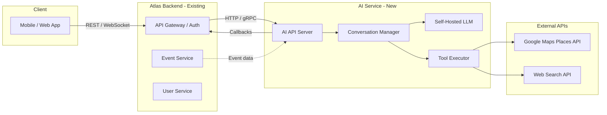
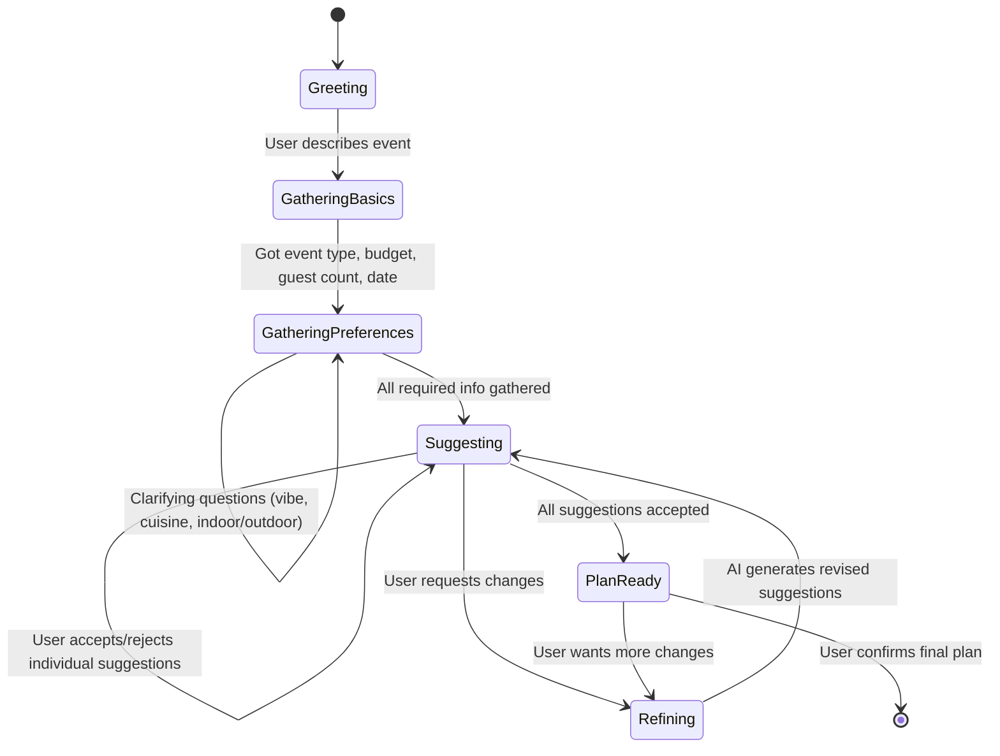
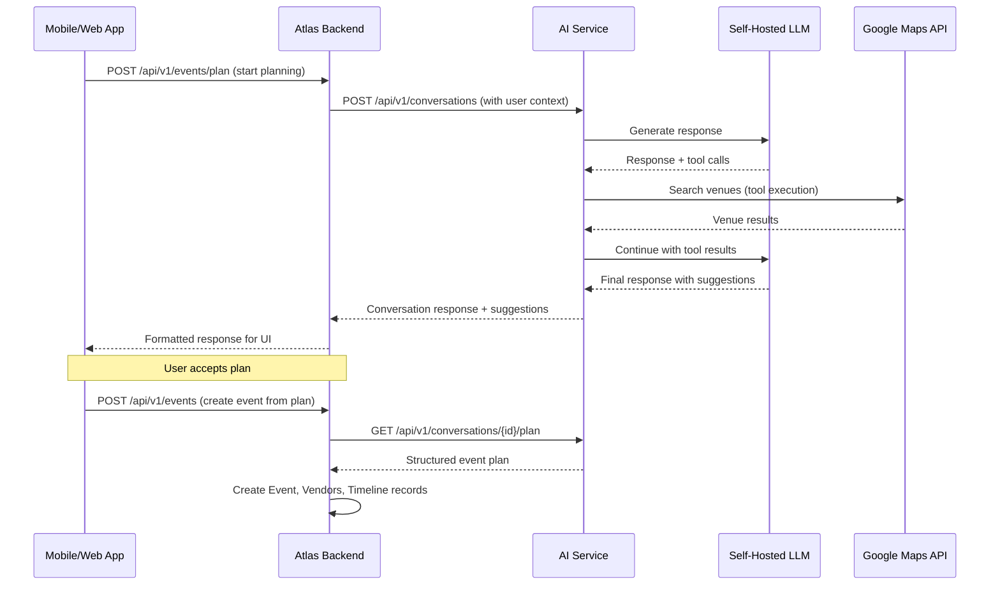
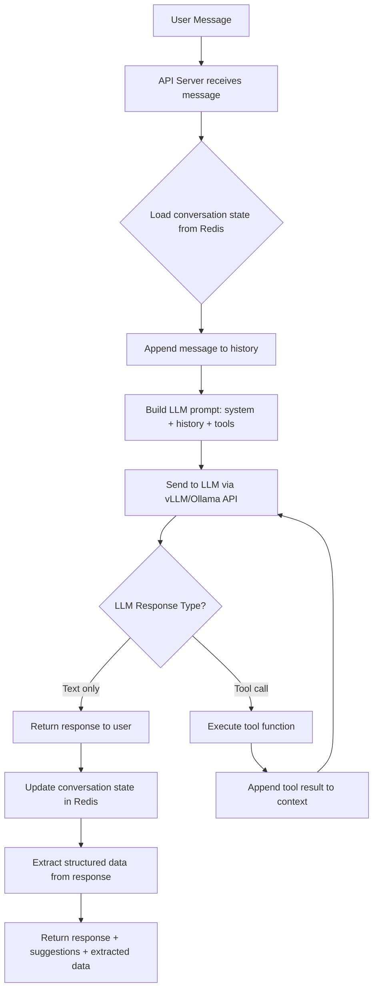
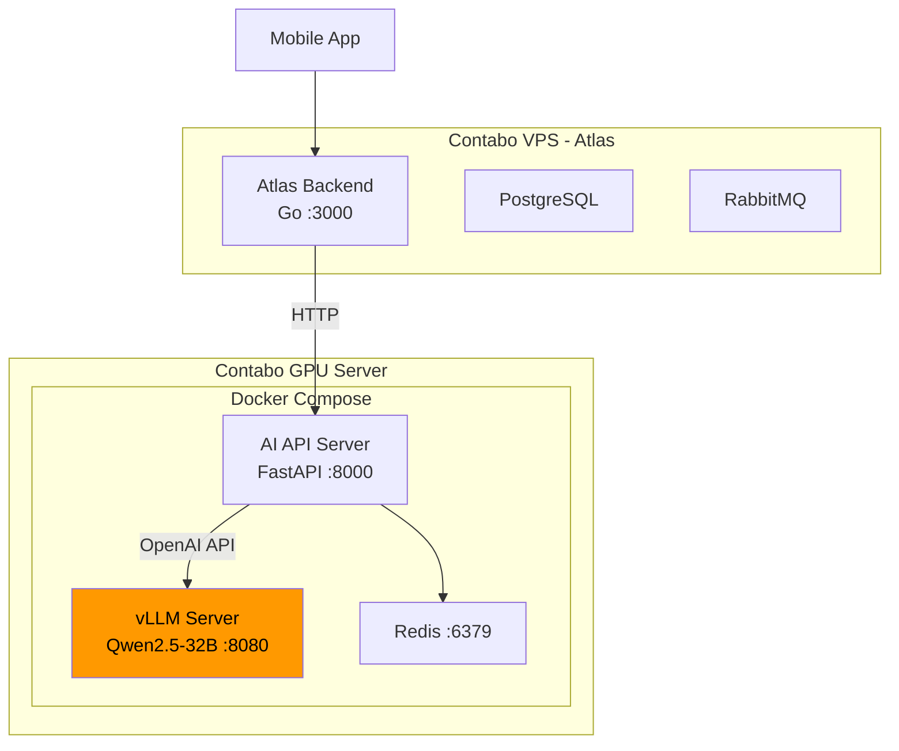

# AI Event Planner Service — Implementation Spec

A separate, self-hosted AI microservice that powers the conversational event-planning experience within the existing Atlas platform. The service guides users through multi-turn conversations to plan events (birthdays, weddings, corporate gatherings, etc.), recommending venues, themes, timelines, catering, entertainment, and décor—all constrained by the user's budget.

---

## 1. High-Level Architecture



**Key principle:** The AI service is a **standalone microservice** that Atlas calls into. It does NOT directly access Atlas's database. Communication is via well-defined API contracts.

---

## 2. LLM Model Recommendation

### Primary Recommendation: **Qwen2.5-32B-Instruct** (or **QwQ-32B**)

| Criteria | Qwen2.5-32B | DeepSeek-V3 | Llama 3.1 70B |
|---|---|---|---|
| **Parameters** | 32B | 685B (MoE, ~37B active) | 70B |
| **VRAM Required** | ~18GB (Q4) / ~64GB (FP16) | ~120GB+ (FP16) | ~40GB (Q4) / ~140GB (FP16) |
| **Tool/Function Calling** | ✅ Excellent native support | ✅ Strong (V3.1+) | ✅ Good (tool-use variants) |
| **Multilingual** | ✅ Best-in-class | ✅ Good | ⚠️ English-centric |
| **Structured Output** | ✅ Excellent JSON mode | ✅ Good | ✅ Good |
| **License** | Apache 2.0 | MIT | Llama 3.1 Community |
| **Contabo Fit** | ✅ Runs on single L40S (48GB) | ❌ Needs multi-GPU H100/H200 | ⚠️ Needs L40S+ quantized |

> [!TIP]
> **Why Qwen2.5-32B?** Best balance of quality, tool-calling capability, multilingual support (important for ₦-denominated Nigerian market), and hardware efficiency. It runs comfortably on a single Contabo L40S GPU (48GB VRAM) with Q8 quantization, keeping hosting costs manageable.

### Fallback / Budget Option: **DeepSeek-V3 (distilled 8B/14B variants)** or **Llama 3.1 8B**
- If budget is very tight, a quantized 8B model can run on a CPU-only VPS with Ollama, but quality will degrade significantly for multi-step planning.

### Inference Stack

| Component | Tool |
|---|---|
| Model serving | **vLLM** (production) or **Ollama** (simpler setup) |
| API compatibility | OpenAI-compatible API endpoint (both vLLM and Ollama support this) |
| Quantization | GPTQ / AWQ (4-bit or 8-bit) for reduced VRAM |

---

## 3. Contabo Hosting Recommendation

| Tier | Server | GPU | VRAM | Best For |
|---|---|---|---|---|
| **Recommended** | Cloud GPU L40S | NVIDIA L40S | 48GB | Qwen2.5-32B (Q8), low-medium traffic |
| Premium | Dedicated H100 | NVIDIA H100 | 80GB | Full FP16 models, high concurrency |
| Budget | VPS (CPU only) | None | — | 8B models via Ollama (limited quality) |

> [!IMPORTANT]
> For a production event-planning service targeting the Nigerian market, the **L40S** tier is the minimum recommended. CPU-only inference will result in unacceptably slow response times (30-60s per message vs 2-5s on GPU).

---

## 4. AI Service API Design

### 4.1 Tech Stack

| Layer | Technology | Rationale |
|---|---|---|
| **Language** | Python 3.12+ | Best LLM ecosystem (LangChain, vLLM, etc.) |
| **Framework** | FastAPI | Async, OpenAPI docs, WebSocket support |
| **LLM Orchestration** | LangChain / LangGraph | Multi-turn conversation, tool calling, state machines |
| **Database** | Redis | Conversation state/session caching |
| **Task Queue** | Celery + Redis | Async tool execution (venue search, etc.) |
| **Containerization** | Docker + Docker Compose | Consistent deployment |

### 4.2 Core Endpoints

#### Conversations

```
POST   /api/v1/conversations                    # Start a new planning conversation
POST   /api/v1/conversations/{id}/messages       # Send a user message, get AI response
GET    /api/v1/conversations/{id}                # Get full conversation history
GET    /api/v1/conversations/{id}/plan           # Get the current structured event plan
DELETE /api/v1/conversations/{id}                # End/archive conversation
```

#### Event Plans (generated output)

```
POST   /api/v1/conversations/{id}/plan/accept    # User accepts the generated plan
POST   /api/v1/conversations/{id}/plan/revise    # User requests revision with feedback
GET    /api/v1/conversations/{id}/suggestions     # Get current AI suggestions (venues, themes, etc.)
POST   /api/v1/conversations/{id}/suggestions/{suggestionId}/accept   # Accept a specific suggestion
POST   /api/v1/conversations/{id}/suggestions/{suggestionId}/reject   # Reject a specific suggestion
```

#### Health & Admin

```
GET    /health                                    # Health check
GET    /api/v1/models/status                      # LLM model status
```

### 4.3 Authentication

- The AI service trusts Atlas as the auth gateway
- Atlas forwards an **internal service token** (JWT or API key) + the **user context** (user ID, subscription tier)
- The AI service does NOT handle user authentication directly

```
Authorization: Bearer <atlas-service-token>
X-User-Id: usr_12345
X-User-Tier: premium
```

---

## 5. Conversation Flow & State Machine

The AI uses a state machine to guide the conversation through planning phases:



### 5.1 Conversation State Object

```json
{
  "conversation_id": "conv_abc123",
  "user_id": "usr_12345",
  "state": "gathering_preferences",
  "created_at": "2026-03-02T12:00:00Z",
  "updated_at": "2026-03-02T12:05:00Z",
  "event_details": {
    "type": "birthday_dinner",
    "budget": {
      "amount": 200000,
      "currency": "NGN"
    },
    "guest_count": 20,
    "date": "2026-08-18",
    "vibe": "indoor",
    "preferences": {
      "setup": "private_catering",
      "cuisine": "mixed",
      "include_decor": true,
      "include_entertainment": true
    }
  },
  "suggestions": {
    "venues": [],
    "themes": [],
    "timeline": null,
    "catering": null,
    "entertainment": null,
    "decor": null
  },
  "budget_allocation": {
    "venue": null,
    "catering": null,
    "decor": null,
    "entertainment": null,
    "miscellaneous": null
  },
  "messages": []
}
```

### 5.2 Required Information Checklist

The AI must extract (via conversation) at minimum:

| Field | Required | Example |
|---|---|---|
| Event type | ✅ | Birthday dinner, wedding, corporate |
| Budget | ✅ | ₦200,000 |
| Guest count | ✅ | 20 people |
| Date | ✅ | August 18, 2026 |
| Vibe / Setting | ✅ | Indoor, outdoor, casual, formal |
| Setup preference | ⚠️ Suggested | Restaurant vs private catering |
| Cuisine preference | ⚠️ Suggested | Local, continental, mixed |
| Décor needed | ⚠️ Suggested | Yes/No |
| Entertainment needed | ⚠️ Suggested | Yes/No |
| Location / City | ✅ | Lagos, Abuja, etc. |

---

## 6. Tool Calling / Function Calling

The LLM uses **tool calling** to fetch real-world data during the conversation. This is the critical differentiator from a simple chatbot.

### 6.1 Available Tools

| Tool | Purpose | External API | When Called |
|---|---|---|---|
| `search_venues` | Find event venues near user | Google Maps Places API | When suggesting locations |
| `get_venue_details` | Get venue photos, reviews, hours | Google Maps Place Details API | When user asks about a specific venue |
| `search_caterers` | Find catering services | Google Maps / Web Search | When planning food/refreshments |
| `search_entertainment` | Find DJs, MCs, performers | Web Search | When planning entertainment |
| `estimate_costs` | Break down budget allocation | Internal logic | After preferences gathered |
| `check_availability` | Check if a date works for a venue | Google Maps / Scraping | When confirming venue |
| `web_search` | General web search for ideas | SerpAPI / Brave Search API | For décor ideas, themes, trending options |

### 6.2 Google Maps Places API Integration

```python
# Tool definition for the LLM
search_venues_tool = {
    "name": "search_venues",
    "description": "Search for event venues near a location. Returns venue names, addresses, ratings, and price levels.",
    "parameters": {
        "type": "object",
        "properties": {
            "query": {
                "type": "string",
                "description": "Search query, e.g. 'event venues in Lagos' or 'restaurants with private dining Lekki'"
            },
            "location": {
                "type": "string",
                "description": "City or area, e.g. 'Lagos, Nigeria'"
            },
            "budget_level": {
                "type": "string",
                "enum": ["budget", "moderate", "premium"],
                "description": "Filter by price level relative to the user's budget"
            },
            "guest_count": {
                "type": "integer",
                "description": "Number of guests, to filter venues by capacity"
            }
        },
        "required": ["query", "location"]
    }
}
```

### 6.3 Web Search Integration

For general queries (entertainment options, décor ideas, trending themes), integrate with:
- **Brave Search API** (recommended — generous free tier, no Google dependency)
- **SerpAPI** (alternative — Google results but paid)
- **Tavily** (alternative — built for AI agents)

---

## 7. API Request/Response Examples

### 7.1 Start Conversation

**Request:**
```http
POST /api/v1/conversations
Authorization: Bearer <atlas-service-token>
X-User-Id: usr_12345

{
  "initial_message": "I want to throw a birthday dinner for 20 people with ₦200k"
}
```

**Response:**
```json
{
  "conversation_id": "conv_abc123",
  "state": "gathering_basics",
  "message": {
    "role": "assistant",
    "content": "Great choice! 🎂 A birthday dinner for 20 with ₦200k — we can definitely make that work. Do you already have a date in mind?",
    "suggestions": [],
    "actions": []
  },
  "extracted": {
    "event_type": "birthday_dinner",
    "budget": { "amount": 200000, "currency": "NGN" },
    "guest_count": 20
  }
}
```

### 7.2 Continue Conversation

**Request:**
```http
POST /api/v1/conversations/conv_abc123/messages
Authorization: Bearer <atlas-service-token>
X-User-Id: usr_12345

{
  "content": "August 18th"
}
```

**Response:**
```json
{
  "conversation_id": "conv_abc123",
  "state": "gathering_preferences",
  "message": {
    "role": "assistant",
    "content": "August 18th it is! 📅 Any vibe you're going for? Casual, formal, outdoor, etc.?",
    "suggestions": [],
    "actions": []
  },
  "extracted": {
    "date": "2026-08-18"
  }
}
```

### 7.3 AI Returns Suggestions (with venue data)

```json
{
  "conversation_id": "conv_abc123",
  "state": "suggesting",
  "message": {
    "role": "assistant",
    "content": "Perfect! Here's what I've put together for your birthday dinner:",
    "suggestions": [
      {
        "id": "sug_venue_1",
        "type": "venue",
        "status": "pending",
        "data": {
          "name": "Cafe Bloom",
          "address": "26 Olaniyi St, Lagos, Nigeria",
          "rating": 4.5,
          "price_level": 2,
          "photos": ["https://maps.googleapis.com/..."],
          "estimated_cost": 50000,
          "source": "google_maps",
          "place_id": "ChIJ..."
        }
      },
      {
        "id": "sug_theme_1",
        "type": "theme",
        "status": "pending",
        "data": {
          "name": "Celebration ✨",
          "description": "For festivals, birthdays, brunches, everything really!",
          "color_palette": ["#FFD700", "#FF6B6B", "#4ECDC4"],
          "estimated_cost": 25000
        }
      },
      {
        "id": "sug_timeline_1",
        "type": "timeline",
        "status": "pending",
        "data": {
          "start": "2026-08-18T12:00:00+01:00",
          "end": "2026-08-18T16:00:00+01:00",
          "breakdown": [
            { "time": "12:00", "activity": "Guest arrival & welcome drinks" },
            { "time": "12:30", "activity": "Appetizers served" },
            { "time": "13:00", "activity": "Main course" },
            { "time": "14:00", "activity": "Birthday toast & cake cutting" },
            { "time": "14:30", "activity": "Entertainment & dancing" },
            { "time": "15:30", "activity": "Dessert & wind down" }
          ]
        }
      },
      {
        "id": "sug_catering_1",
        "type": "catering",
        "status": "pending",
        "data": {
          "style": "Mixed (local & continental)",
          "menu_highlights": [
            "Jollof rice & fried plantain",
            "Grilled chicken with herb sauce",
            "Mini meat pies & spring rolls",
            "Fruit salad & small chops"
          ],
          "estimated_cost": 80000,
          "per_head": 4000
        }
      }
    ],
    "actions": ["accept", "reject", "suggest_more"]
  },
  "budget_allocation": {
    "venue": 50000,
    "catering": 80000,
    "decor": 25000,
    "entertainment": 30000,
    "miscellaneous": 15000,
    "total": 200000,
    "remaining": 0
  }
}
```

### 7.4 Accept/Reject Suggestion

**Request:**
```http
POST /api/v1/conversations/conv_abc123/suggestions/sug_venue_1/accept
```

**Response:**
```json
{
  "suggestion_id": "sug_venue_1",
  "status": "accepted",
  "message": "Great, Cafe Bloom is locked in! 📍 Let's look at the theme next."
}
```

---

## 8. Integration with Atlas Backend

### 8.1 Communication Pattern



### 8.2 Atlas-Side Changes (Minimal)

Atlas needs a thin integration layer:

| Component | Change |
|---|---|
| **New Controller** | `controllers/ai_planner.ctrl.go` — proxies planning requests to AI service |
| **New Config** | `AI_SERVICE_URL`, `AI_SERVICE_API_KEY` env vars |
| **New Model (optional)** | `EventPlan` model to store finalized AI-generated plans |
| **RabbitMQ Event** | `event.plan.created` — published when user confirms a plan |

---

## 9. System Prompt Design

The system prompt is the core of the AI's personality and behavior. Below is the recommended structure:

```
You are an expert event planner assistant for [App Name]. You help users in Nigeria
plan memorable events within their budget.

## Your Personality
- Warm, enthusiastic, and professional
- Use emojis sparingly but effectively (🎂 📍 🎊 ⏰)
- Be concise — mobile-first UX means short messages
- Always be encouraging about what's possible within budget

## Your Process
1. GREET the user warmly and ask about their event
2. GATHER essential details one question at a time:
   - Event type, budget, guest count, date, location/city
3. CLARIFY preferences naturally:
   - Vibe (casual/formal), setting (indoor/outdoor)
   - Setup (restaurant vs private), cuisine, décor, entertainment
4. SUGGEST options using your tools:
   - Always search for real venues via search_venues
   - Break down budget allocation transparently
   - Offer 2-3 options per category when possible
5. REFINE based on user feedback (accept/reject/modify)
6. FINALIZE the plan with a clear summary

## Budget Rules
- NEVER suggest options that exceed the stated budget
- Always show a budget breakdown
- Reserve 5-10% for miscellaneous/contingency
- Be transparent about trade-offs ("To add a DJ, we'd need to simplify the décor")

## Tool Usage
- Use search_venues for REAL venue results — never make up venue names
- Use web_search for entertainment, décor ideas, and caterer options
- Use estimate_costs to validate budget allocations
- Always cite sources when sharing venue or vendor info

## Response Format
- Keep messages SHORT (2-4 sentences max for questions)
- When presenting suggestions, use structured data (the app will render cards)
- Present one topic at a time — don't overwhelm the user
- Ask ONE question at a time during the gathering phase

## Currency
- Default currency is Nigerian Naira (₦ / NGN)
- Always format prices with the ₦ symbol
```

---

## 10. Data Flow: Message Processing Pipeline



---

## 11. Project Structure

```
ai-planner-service/
├── app/
│   ├── main.py                  # FastAPI app entry point
│   ├── config.py                # Environment config
│   ├── api/
│   │   ├── routes/
│   │   │   ├── conversations.py # Conversation CRUD endpoints
│   │   │   ├── suggestions.py   # Suggestion accept/reject endpoints
│   │   │   └── health.py        # Health check
│   │   ├── middleware/
│   │   │   ├── auth.py          # Atlas service token validation
│   │   │   └── rate_limit.py    # Rate limiting
│   │   └── schemas/
│   │       ├── conversation.py  # Pydantic models for conversations
│   │       ├── suggestion.py    # Pydantic models for suggestions
│   │       └── event_plan.py    # Pydantic models for finalized plans
│   ├── core/
│   │   ├── conversation.py      # Conversation manager (state machine)
│   │   ├── planner.py           # LLM orchestration (LangChain/LangGraph)
│   │   └── budget.py            # Budget allocation logic
│   ├── tools/
│   │   ├── base.py              # Base tool interface
│   │   ├── venues.py            # Google Maps venue search
│   │   ├── web_search.py        # Brave/SerpAPI web search
│   │   ├── cost_estimator.py    # Budget breakdown calculator
│   │   └── entertainment.py     # Entertainment search
│   ├── llm/
│   │   ├── client.py            # LLM API client (OpenAI-compatible)
│   │   ├── prompts.py           # System prompts and templates
│   │   └── tools_schema.py      # Tool definitions for function calling
│   └── storage/
│       ├── redis_store.py       # Redis conversation state store
│       └── models.py            # Data models
├── docker-compose.yml           # Service + Redis + vLLM
├── Dockerfile                   # AI service container
├── requirements.txt
├── .env.example
└── tests/
    ├── test_conversation.py
    ├── test_tools.py
    └── test_budget.py
```

---

## 12. Deployment Architecture (Contabo)



### Docker Compose

```yaml
version: "3.8"
services:
  ai-api:
    build: .
    ports:
      - "8000:8000"
    environment:
      - LLM_BASE_URL=http://vllm:8080/v1
      - LLM_MODEL=Qwen/Qwen2.5-32B-Instruct
      - REDIS_URL=redis://redis:6379
      - GOOGLE_MAPS_API_KEY=${GOOGLE_MAPS_API_KEY}
      - BRAVE_SEARCH_API_KEY=${BRAVE_SEARCH_API_KEY}
      - ATLAS_SERVICE_SECRET=${ATLAS_SERVICE_SECRET}
    depends_on:
      - vllm
      - redis

  vllm:
    image: vllm/vllm-openai:latest
    ports:
      - "8080:8000"
    volumes:
      - ./models:/root/.cache/huggingface
    deploy:
      resources:
        reservations:
          devices:
            - driver: nvidia
              count: 1
              capabilities: [gpu]
    command: >
      --model Qwen/Qwen2.5-32B-Instruct
      --quantization awq
      --max-model-len 8192
      --gpu-memory-utilization 0.9
      --enable-auto-tool-choice
      --tool-call-parser hermes

  redis:
    image: redis:7-alpine
    ports:
      - "6379:6379"
    volumes:
      - redis_data:/data

volumes:
  redis_data:
```

---

## 13. Key Design Decisions & Trade-offs

| Decision | Choice | Rationale |
|---|---|---|
| **Separate service vs embedded in Atlas** | Separate | Different runtime (Python vs Go), independent scaling, GPU isolation |
| **Stateful conversations in Redis vs DB** | Redis (with periodic DB snapshots) | Speed for real-time chat; finalized plans get persisted to Atlas's PostgreSQL |
| **LangChain vs raw API calls** | LangChain/LangGraph | Built-in tool calling, conversation memory, state machine support |
| **vLLM vs Ollama** | vLLM for production | Higher throughput, better batching, production-grade; Ollama for dev |
| **Google Maps vs custom venue DB** | Google Maps API first | Faster to market; can build custom DB later from accumulated data |
| **WebSocket vs polling** | HTTP with SSE (Server-Sent Events) | Simpler than WebSocket, sufficient for chat UX, progressive response streaming |

---

## 14. Cost Estimates

| Item | Monthly Cost (est.) |
|---|---|
| Contabo Cloud GPU L40S | €180-250/mo |
| Google Maps Places API (1000 queries/day) | ~$30/mo |
| Brave Search API (free tier) | $0-9/mo |
| Redis (bundled in Docker) | $0 |
| **Total** | **~€220-290/mo** |

---

## 15. Security Considerations

- **Service-to-service auth**: Atlas ↔ AI service via shared secret / mutual TLS
- **No direct public access**: AI service is only reachable from Atlas, not from the internet
- **PII handling**: Conversation data is ephemeral in Redis (TTL-based expiry); finalized plans are stored in Atlas
- **Rate limiting**: Per-user rate limits to prevent abuse (e.g., 30 messages/minute)
- **Prompt injection mitigation**: Input sanitization, output validation, structured output enforcement

---

## 16. Future Enhancements

- [ ] **Vendor marketplace integration** — connect with verified caterers, decorators, DJs
- [ ] **Image generation** — AI-generated mood boards for décor themes
- [ ] **Voice input** — Whisper integration for voice-to-text planning
- [ ] **Multi-event templates** — pre-built templates for weddings, corporate events, etc.
- [ ] **Collaborative planning** — multiple users co-planning an event
- [ ] **Post-event feedback loop** — improve suggestions based on event outcomes
- [ ] **Custom venue database** — build a curated venue DB from Google Maps data over time
- [ ] **WhatsApp integration** — plan events via WhatsApp Business API

---

## User Review Required

> [!IMPORTANT]
> **LLM Model Choice**: The spec recommends **Qwen2.5-32B-Instruct** over DeepSeek-V3 due to Contabo hardware constraints. DeepSeek-V3 (685B params) would require multi-GPU H100 setup (~€500+/mo). Are you open to Qwen, or do you strongly prefer DeepSeek (in which case we'd need a distilled/smaller variant)?

> [!IMPORTANT]
> **Web Search Provider**: The spec suggests **Brave Search API** for general web lookups (entertainment, décor ideas). Alternatives include SerpAPI (Google results, paid) or Tavily (AI-optimized, paid). Any preference?

> [!IMPORTANT]
> **Response Streaming**: Should the AI responses stream token-by-token (like ChatGPT) via SSE, or return complete responses? Streaming provides better UX but adds frontend complexity.

> [!WARNING]
> **Google Maps Places API** is a paid API. The Places API (New) charges per request. At scale, this could become a significant cost. An alternative is to build a curated venue database over time and fall back to Google Maps only for uncached searches.
